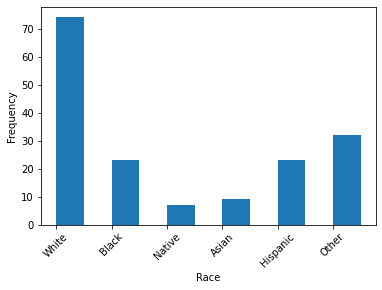

## Motivation
Welcome to my personal dataset project. For my project I am focusing on the question: Who is most affected by police shootings. My motivation behind this project is the 
constant discussions throughout my life of racial prejudice in the relationship between the African-American population and the various police forces throughout the country.

Being a black person myself, I feel the need to shine a light on truth of the situation using data analytics. Being a serious issue, I pledge to let the numbers tell the story. I understand that numbers do not lie, but people can make the numbers tell any story they want to. This being known, I feel it is my duty to take on this project from a ethical perspective and attitude, and let the truth speak in the purest way possible. 

## Data Sources
The data I am using was collected from an ongoing database controlled by the Washington Post, who have an ongoing spreadsheet of police shootings throughout all of the United States starting from 2015 to present day. 

## Processing Steps
Due to the database of police shootings in the United States since 2015 was such a big dataset, I decided that I will only focus on Washington State for this project. The data in the spreadsheet given by the Washington Post was very organized and clean already, so luckily I only had to make a few additions to the set in order to start work. A struggle that I had with this datset is that a lot of it is string or boolean based. This meant I had to make some choices in how I was going to interpret them in python. For the boolean data types I just converted the cells to integers using `INT(cell)` to change them into 1s and 0s. For the string based data I decided to group some of the data together before changing them into integers. For example, I 

## Visualization
Once I processed the data and isolated shooting incidents to only Washington State, I created a simple but clear histogram that divided the police shootings by race. To do this, I made a secondary column next to the `RACE` column in the spreadsheet and created corresponding numbers to each of the races in the dataframe (I put other and unknown races together for a cleaner set). From this visualization, we can see that there are about twice as many white men shot and killed by police than other races.

## Analysis
After completing my main task of finding the highest number of people who were shot by police in Washington from 2015 - present, I became curious as to how I can use the database's various other variables to look at the data from another perspective. The first plot here is an overall look into how many of the people shot and killed fled and did not flee. 

# put generalized flee plot here

The next plots are a series of flee plots, but separated by race to give some insight on the situations that occured for each race. 

# add flee plots by race here

## About The Raw Data
The spreadsheet has many variables that are ambiguous to those who aren't particularly familiar with the data or subject itself. This section is to help the reader understand the spreadsheet better.

`ID`: Shows the chronological order of the police shootings. Data with an ID of 1 means that was the first shooting in the dataset, 2 meaning the second shooting, and so forth.

`NAME`: The name of the person who was killed in the police shooting.

`DATE`: Date of the shooting in the format D/MM/YYYY.

`MANNER OF DEATH`: This column will show:
- `shot`
- `shot and tasered`

`AGE`: The age of the person killed in the police shooting.

`GENDER`: The gender of the person killed in the police shooting:
- `M` for Male 
- `F` for Female
- `None` for other identified gender

`RACE`: The race of the person killed.  
- `W`: White (non-Hispanic)
- `B`: Black (non-Hispanic)
- `N`: Native-American
- `A`: Asian
- `H`: Hispanic
- `O`: Other
- `None`: Unknown

`CITY`: The city of origin where the police shooting occured.

`STATE`: The state of origin where the police shooting occured. In this project, the state will always be Washington.

`MENTAL ILL.`: Indicates if there was a case of mental illness in the person killed by police.

`THREAT LEVEL`: Indicates what level of threat the officer(s) felt at the time of the shooting. By law, an officer is allowed to use lethal force if they feel that there is a direct and immediate threat to life. The levels in the spreadsheet include:
- `attack`: The most direct and immediate threat level, which allows an officer of the law enact lethal force on the person causing that direct and immediate threat towards them. 
- `other` and `undetermined`: The remaining threat levels in the remaining cases. 

`FLEE`: Category that indicates whether the person tried to flee before being killed. 
- `Not Fleeing`: indicates that the person did not flee
- `Foot`: Indicates the person fled by foot
- `Car`: Indicates the person fled by car

`BODY CAM`: Indicates if the police officer(s) involved in the shooting had a body camera/had their body camera on. This will result in each cell having either `TRUE` or `FALSE`.

`LONG` and `LAT` show the latitude and longitude of the shooting.

`EXACT GEOCODING`: If the latitude and longitude is accurate to 100 meters of the actual location of the shooting, the cell will show `TRUE`. If not, the cell will show `FALSE`. 
